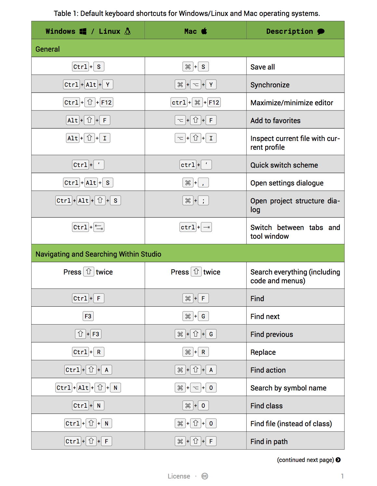

## Tex Cheat Sheet

An attempt at creating a resuable template for creating application's keyboard 
shortcuts using LaTex. It supports Roboto's family of fonts and the popular 
FontAwesome.

### Sample Screenshots For Android Studio Keyboard Shortcuts

### Generate PDF

This will generate keyboard [shortcuts](dist/android-studio-shortcuts.pdf) for Android Studio

`xelatex -output-directory=dist android-studio-shortcuts.tex` 

*Note:* Make sure [LaTex][1] is installed on the machine. On Mac install [MacTeX][2]

[1]: https://www.latex-project.org/
[2]: https://tug.org/mactex/